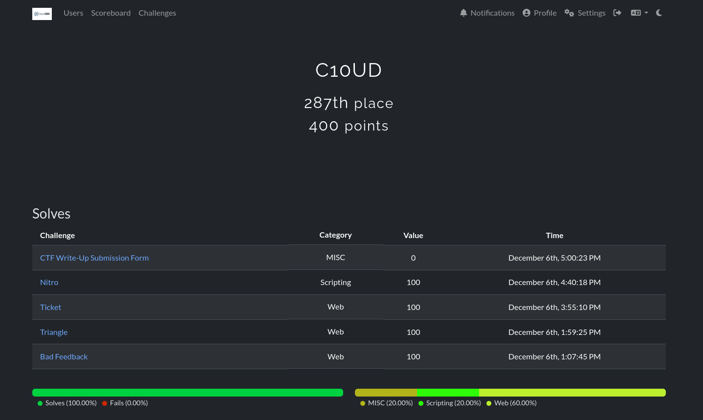

# 🛡️ CloudSEK Hiring CTF — Technical Write-ups  
**Author:** C10UD  
**CTF Date:** 6 Dec 2025  

---

## 📌 About This Repository

This repository contains my personal approach to solving the challenges from the CloudSEK Hiring CTF.

> Every CTF challenge can be solved in multiple ways depending on a player’s knowledge and perspective, these write-ups specifically showcase **my methodology and exploitation flow** used to reach the solution.

---

## 🏁 Challenges Covered

| # | Challenge Name | Category | Write-up |
|---|----------------|----------|----------|
| 1 | **Bad Feedback** | Web Security | [View](challenges/Bad%20Feedback/01-bad-feedback.md) |
| 2 | **Triangle** | Web Security | [View](challenges/Triangle/02-triangle.md) |
| 3 | **Ticket** | Application Security | [View](challenges/Ticket/03-ticket.md) |
| 4 | **Nitro** | Scripting / Automation | [View](challenges/Nitro/04-nitro.md) |

> 📁 Each challenge has its own dedicated markdown file with a full technical breakdown.

---

## 🏆 Scoreboard

---

## ⚠️ Disclaimer

These write-ups are part of a **legal hiring CTF** and are shared **strictly for educational purposes**.

---
