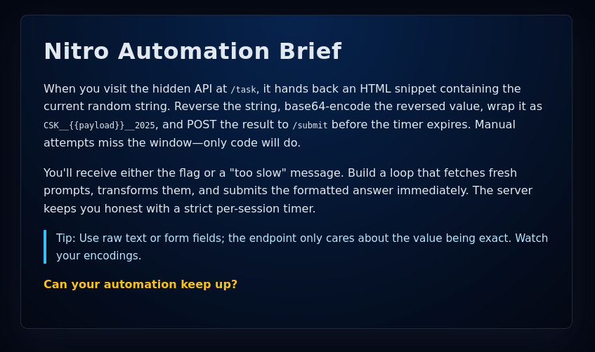

# ⚡ Nitro

**Category:** Web | Automation

> Ready your scripts! Only automation will beat the clock and unlock the flag.

**Challenge URL:** [http://15.206.47.5:9090](http://15.206.47.5:9090)

---

## 🔍 Initial Reconnaissance

Upon visiting the challenge URL, a briefing page explained that the application exposes a **hidden API endpoint at `/task`** which returns a **randomly generated string** inside an HTML snippet.



The rules were clearly defined:

* Reverse the received string
* Base64-encode the reversed value
* Wrap it in the format:

  ```
  CSK__<ENCODED_VALUE>__2025
  ```
* Submit the final value to `/submit` **before the session timer expires**

Manual attempts consistently failed due to the **strict per-session time limit**, confirming that **automation was mandatory**.

---

## 🔍 Key Observation

* The token is **session-bound**
* The timer is **server-side enforced**
* Submitting from a different session always results in **"Too Slow"**
* The `/submit` endpoint only validates the **raw exact payload value**

This confirmed:
✅ A **persistent session** is required
✅ The entire process must be **fully automated**

---

## 🛠️ Automation Script

The following Python script was used to fully automate the challenge:

```python
import requests
import base64
import re

BASE_URL = "http://15.206.47.5:9090"

# ✅ Create ONE persistent session (THIS IS THE KEY FIX)
session = requests.Session()

# 1️ Fetch the task (SESSION BOUND)
task_url = BASE_URL + "/task"
task_response = session.get(task_url)
task_text = task_response.text

print("[+] Task Response:", task_text)

# 2️ Extract token
m = re.search(r"input string:\s*([A-Za-z0-9]+)</p>", task_text)
if not m:
    print("[-] Token extraction failed")
    exit()

token = m.group(1)
print("[+] Token:", token)

# 3️ Reverse + Base64 encode
reversed_token = token[::-1]
b64 = base64.b64encode(reversed_token.encode()).decode()
payload = f"CSK__{b64}__2025"

print("[+] Final Payload:", payload)

# 4️ SUBMIT USING THE SAME SESSION (RAW BODY)
submit_url = BASE_URL + "/submit"
headers = {"Content-Type": "text/plain"}

submit_response = session.post(
    submit_url,
    data=payload.encode(),
    headers=headers
)

print("\n✅✅✅ SERVER RESPONSE ✅✅✅\n")
print(submit_response.text)
```

---

## ✅ Result

Script execution:

```
[+] Task Response: <p>Here is the input string: rj8uwd85RPtB</p>
[+] Token: rj8uwd85RPtB
[+] Final Payload: CSK__QnRQUjU4ZHd1OGpy__2025

✅✅✅ SERVER RESPONSE ✅✅✅

Nice automation! Here is your flag: ClOuDsEk_ReSeArCH_tEaM_CTF_2025{ab03730caf95ef90a440629bf12228d4}
```

---

## 🚩 Flag

```
ClOuDsEk_ReSeArCH_tEaM_CTF_2025{ab03730caf95ef90a440629bf12228d4}
```

---

## 🧠 Final Takeaway

> When the server enforces strict timing and session binding, **manual interaction becomes impossible — only automation wins.**

---
